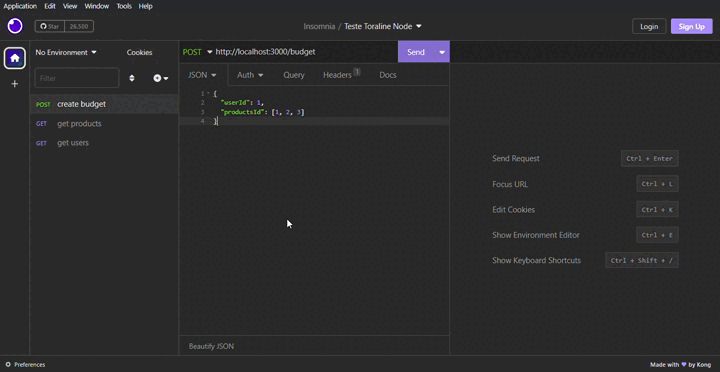
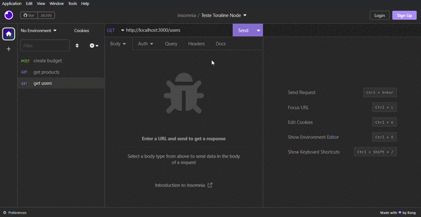
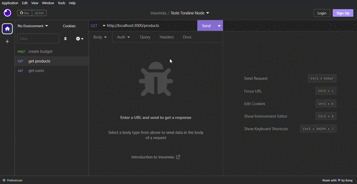
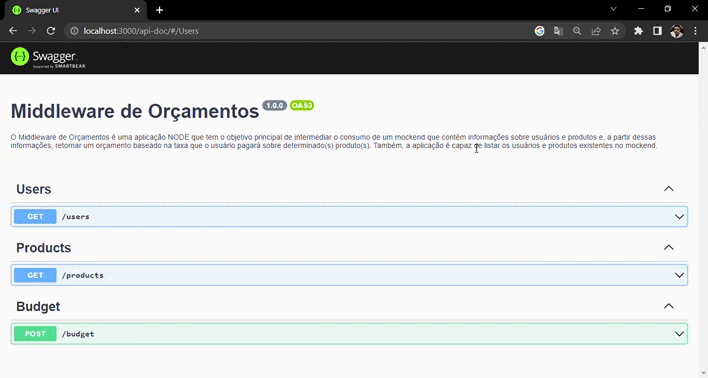

<h1 style="text-align: center">MIDDLEWARE DE ORÇAMENTOS</h1>

<br>

<div style="display:flex; justify-content:center">

</div>

<br>

<h1>🏁 APRESENTAÇÃO</h1>

<br>

<p style="text-align: justify">O Middleware de Orçamentos é uma aplicação NODE que tem o objetivo principal de intermediar o consumo de um mockend que contém informações sobre usuários e produtos e, a partir dessas informações, retornar um orçamento baseado na taxa que o usuário pagará sobre determinado(s) produto(s). Também, a aplicação é capaz de listar os usuários e produtos existentes no mockend.</p>

<br>

<h1>🏹 ROTAS</h1>

<br>

### ▪️ Listar usuários

<br>

> GET /users - FORMATO DA REQUISIÇÃO

<br>

Não é necessário corpo da requisição

<br>

Caso tudo dê certo, a resposta será assim:

<br>

> GET /users- FORMATO DA RESPOSTA - STATUS 200

<br>

```JSON
[
	{
		"id": 1,
		"name": "cvRhuZicvV",
		"tax": 79
	},
	{
		"id": 2,
		"name": "P5hBDBonm3",
		"tax": 121
	},
	{
		"id": 3,
		"name": "buTTe8n3gT",
		"tax": 82
	}
]
```

<br>

### ▪️ Listar Produtos

<br>

> GET /products - FORMATO DA REQUISIÇÃO

<br>

Não é necessário corpo da requisição

<br>

Caso tudo dê certo, a resposta será assim:

<br>

> GET /products- FORMATO DA RESPOSTA - STATUS 200

<br>

```JSON
[
	{
		"id": 1,
		"name": "explicabo alias hic reprehenderit deleniti quos id reprehenderit consequuntur ipsam iure voluptatem ea culpa excepturi ducimus repudiandae ab",
		"price": 6945
	},
	{
		"id": 2,
		"name": "nostrum veritatis reprehenderit repellendus vel numquam soluta ex inventore ex",
		"price": 2435
	},
	{
		"id": 3,
		"name": "praesentium explicabo reprehenderit laudantium a pariatur ab sit pariatur quos",
		"price": 4985
	},
]
```

<br>

### ⚠️ Possíveis Erros

<br>

<p style="text-align: justify">As rotas que utilizam o verbo HTTP GET apresentam alguns tratamentos de erros baseados nos tipos de problemas que ocorrem durante a requisição e/ou resposta. Esses erros são tratados automaticamente e de maneira genérica a partir das respostas do servidor e do cliente que são instâncias da <a href="https://axios-http.com/docs/handling_errors"><strong>API AxiosError</strong></a>. Caso o problema não seja instância dessa API, o erro é apresentado da seguinte forma:   </p>

<br>

> GET /users ou GET /products- FORMATO DA RESPOSTA - STATUS 400

<br>

```JSON
{
  "message": "An unexpected error occurred"
}
```

<br>

### ▪️ Calcular orçamento

<br>

<p style="text-align: justify">Para calcular o orçamento é necessário enviar um objeto JSON contendo o id do usuário e uma lista com o(s) id(s) do(s) produto(s) que se quer conhecer o valor final. Cada usuário possui uma taxa (<i>tax</i>), que é utilizada para calcular quanto pagará sobre o valor (<i>price</i>) de cada produto da lista.</p>

<br>

> POST /budget - FORMATO DA REQUISIÇÃO

<br>

```JSON
{
	"userId": "number",
	"productsId": ["number", "number", "number"]
}
```

<br>

Caso tudo dê certo, a resposta será assim:

<br>

> POST /budget - FORMATO DA RESPOSTA - STATUS 201

<br>

```JSON
{
  "value": "number"
}
```

<br>

### ⚠️ Possíveis Erros

<br>

<p style="text-align: justify">Os erros da rota POST /budget, além do tratamento genérico dos erros que são instância da API AxiosError, também conta com validações da requisição. Caso o id do usuário não seja um valor positivo:</p>

<br>

> POST /budget - FORMATO DA RESPOSTA - STATUS 400

<br>

```JSON
{
    "message": [
		"userId must be a positive number"
	    ]
}
```

<br>

<p>Caso o id do usuário não seja do tipo número:</p>

<br>

> POST /budget - FORMATO DA RESPOSTA - STATUS 400

<br>

```JSON
{
    "message": [
		"userId must be a `number` type"
	    ]
}
```

<br>

<p>Caso a lista de produtos esteja vazia:</p>

<br>

> POST /budget - FORMATO DA RESPOSTA - STATUS 400

<br>

```JSON
{
    "message": [
		"The array must have at least one product"
	    ]
}
```

<br>

<p>Caso a lista de produtos contenha algum valor que não seja um número:</p>

<br>

> POST /budget - FORMATO DA RESPOSTA - STATUS 400

<br>

```JSON
{
	"message": "the array must only contain numbers"
}
```

<br>

<p>Caso o campo userId não seja enviado:</p>

<br>

> POST /budget - FORMATO DA RESPOSTA - STATUS 400

<br>

```JSON
{
    "message": [
		"Required field userId"
	    ]
}
```

<br>

<p>Caso o campo productsId não seja enviado:</p>

<br>

> POST /budget - FORMATO DA RESPOSTA - STATUS 400

<br>

```JSON
{
    "message": [
		"Required field productsId"
	    ]
}
```

<br>

<h1>💻 INSTALAÇÃO  E EXECUÇÃO</h1>

<br>

<p style="text-align: justify">Para executar a aplicação é preciso baixá-la ou realizar um clone para seu computador, certifique-se de fazer isso a partir da branch "main". Antes de rodar a aplicação é preciso ter o Node instalado na máquina e também um gerenciador de pacotes, como o npm ou yarn.</p>

<br>

### ▪️ Utilizando yarn

<br>

<p>Para instalar as dependências, na raiz do projeto utilize:</p>

```shell
yarn install
```

<p>Para executar o servidor utilize:</p>

```shell
yarn dev
```

<br>

### ▪️ Utilizando npm

<br>

<p>Para instalar as dependências, na raiz do projeto utilize:</p>

```shell
npm install
```

<p>Para executar o servidor utilize:</p>

```shell
npm run dev
```

<br>

<h1>👨‍💻 UTILIZANDO A APLICAÇÃO</h1>

<br>

<p style="text-align: justify">Se os passos de instalação e execução deveram certo, provalvelmente terá uma mensagem terminal com o dizer "Servidor executando". Por padrão, ele será executado na porta 3000, utilize o endereço <a href="http://localhost:3000">http://localhost:3000</a> como base para utilizar os endpoints da aplicação. É recomendável utilizá-la a partir de algum software para teste de API Cliente, como o <a href="https://insomnia.rest/download">Insomnia</a>. Alternativamente, você pode utilizar a aplicação a partir da documentação swagger embutida no código.</p>

<br>

## ▪️ Utilizando com Insomnia

<br>

### ▪️ Exemplo utilizando o endpoint GET /users

<br>

<div style="display:flex; justify-content:center">

</div>

<br>

### ▪️ Exemplo utilizando o endpoint GET /products

<br>

<div style="display:flex; justify-content:center">

</div>

<br>

### ▪️ Exemplo utilizando o endpoint POST /budget

<br>

<div style="display:flex; justify-content:center">

</div>

<br>

## ▪️ Utilizando com Swagger

<br>

<p>O documento swagger é um recurso que lista as rotas disponíveis numa aplicação, com a possibilidade de testá-las diretamente pelo navegador. Com o servidor em execução, visite o seguinte endereço: <a href="http://localhost:3000/api-doc/">http://localhost:3000/api-doc/</a></p>

<br>

### ▪️ Exemplo utilizando os três endpoints com swagger

<br>

<div style="display:flex; justify-content:center">

</div>

<br>

<h1>👁‍🗨 TESTES UNITÁRIOS</h1>

<br>

<p style="text-align: justify">A aplicação conta com testes unitários para os três endpoints. Os testes buscam verificar o sucesso nas requisições e o tratamento de alguns erros. Para utilizá-los, deve-se encerrar o servidor (Ctrl + c) primeiro. É recomendável testar um arquivo de cada vez.</p>

<br>

### ▪️ Testando com yarn

<br>

<p>Para testar a rota GET /users, utilize:</p>

```shell
yarn test ./src/__tests__/services/listUsers.spec.ts
```

<br>

<p>Para testar a rota GET /products, utilize:</p>

```shell
yarn test ./src/__tests__/services/listProducts.spec.ts
```

<br>

<p>Para testar a rota POST /budget, utilize:</p>

```shell
yarn test ./src/__tests__/services/calculateBudget.spec.ts
```

<br>

### ▪️ Testando com npm

<br>

<p>Para testar a rota GET /users, utilize:</p>

```shell
npm run test ./src/__tests__/services/listUsers.spec.ts
```

<br>

<p>Para testar a rota GET /products, utilize:</p>

```shell
npm run test ./src/__tests__/services/listProducts.spec.ts
```

<br>

<p>Para testar a rota POST /budget, utilize:</p>

```shell
npm run test ./src/__tests__/services/calculateBudget.spec.ts
```

<br>

<h1>🚀 PRINCIPAIS TECNOLOGIAS</h1>

<br>

<ul>
<li>NODE</li>
<li>TYPESCRIPT</li>
<li>EXPRESS</li>
<li>YUP</li>
<li>AXIOS</li>
<li>EXPRESS-ASYNC-ERRORS</li>
<li>TESTES COM JEST</li>
</ul>
